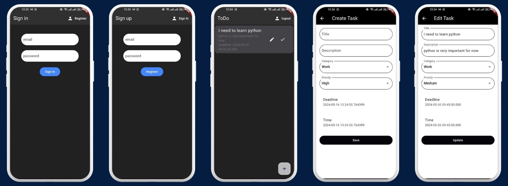

# To Do App

Task Managment Using Flutter and Firebase.

## Table of Contents

- [Introduction](#introduction)
- [Features](#features)
- [Installation](#installation)
- [Structure](#structure)

## Introduction

Developing a ToDo application for managing a list of tasks, using firebase for **Authentication** and **Storing Data** with firestore, and Provider for **State Management**.

## Features

Flutter dependencies and versions :
- provider: ^6.1.2
- flutter_spinkit: ^5.2.1
- firebase_core: ^2.31.0
- cloud_firestore: ^4.17.3
- firebase_auth: ^4.19.5

## Installation

To get started with this project, follow these steps:
1. **Clone the Repository**: 
   ```bash
   git clone https://github.com/HaTem001/toDoApp-flutter-firebase.git

2. **Navigate to the Project Directory**
3. **Install Dependencies**
      ```bash
   flutter pub get
5. **Set Up Firebase**
6. **Run the Application**


## ScreenShots




## Structure

```
│
├───lib
│   │   firebase_options.dart
│   │   main.dart
│   │
│   ├───models
│   │       task.dart
│   │       user.dart
│   │
│   ├───screens
│   │   │   wrapper.dart
│   │   │
│   │   ├───authenticate
│   │   │       authenticate.dart
│   │   │       register.dart
│   │   │       sign_in.dart
│   │   │
│   │   ├───home
│   │   │       home.dart
│   │   │
│   │   └───task
│   │           edit_task_screen.dart
│   │
│   ├───services
│   │       auth.dart
│   │       database.dart
│   │       task_provider.dart
│   │
│   └───shared
│           constants.dart
│           loading.dart
```

